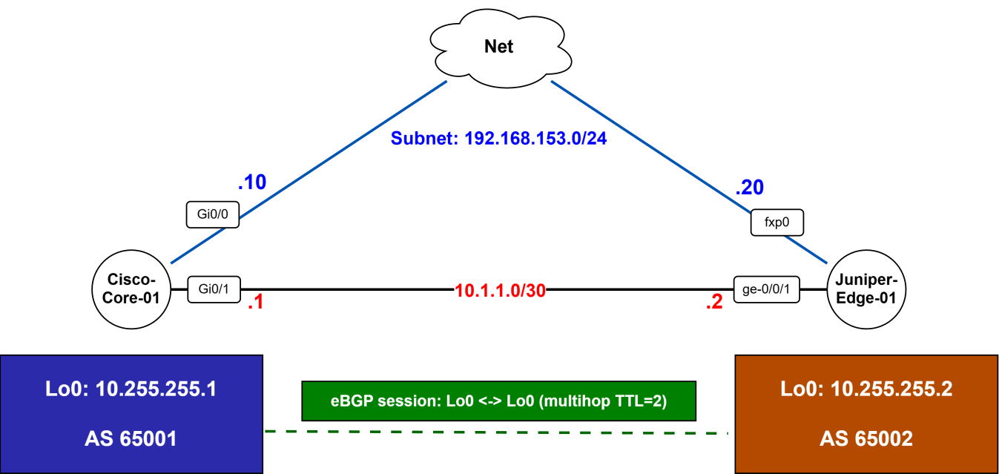

# Indirect (Loopback-to-Loopback) eBGP Peering — Cisco ↔ Juniper

## Problem Statement
A Cisco IOS core router and a Juniper Junos edge router need to exchange an enterprise prefix (`172.16.100.0/24`) over eBGP. A directly-connected physical-interface eBGP session is fragile — if that specific link drops, the session drops even when another underlying path to the peer exists. The goal is a BGP design that survives single-link failure as long as IP reachability between the two devices persists through some other path.

## Learning Objective
- Understand why and how to peer eBGP over loopback addresses instead of physical interfaces.
- Understand the multihop TTL requirement this introduces and why it exists.
- Understand the platform difference in default BGP export behavior between Cisco IOS and Junos, and how to correct for it.
- Build a repeatable, automated way to validate that a BGP session is not just *established* but actually *propagating routes*.

## Requirements
- eBGP session between AS 65001 (Cisco) and AS 65002 (Juniper) sourced from loopback addresses.
- Enterprise prefix `172.16.100.0/24` originated on the Juniper side and received into the Cisco routing table.
- Session must remain resilient to failure of a single underlying path.
- Automated verification of both session state and prefix propagation (not session state alone).

## Assumptions
- Underlay (IGP/static) reachability between the two loopbacks already exists or is provisioned via static routes, as shown in the configuration.
- Both devices are reachable via SSH/Netconf for automation (Netmiko) from the validation host.
- The enterprise prefix is anchored locally on the Juniper side via a discard route, so it has something concrete to advertise.
- No route reflectors, confederations, or additional AS-path considerations are in scope — this is a single eBGP hop between two ASes.

## Topology

```
   AS 65001                                   AS 65002
 Cisco-Core-01                              Juniper-Edge-01
 Lo0: 10.255.255.1                          Lo0: 10.255.255.2
      |                                            |
      |  Underlay link (physical/IGP reachability) |
      +--------------------------------------------+
              eBGP session: Lo0 <-> Lo0 (multihop TTL=2)
                     Advertises: 172.16.100.0/24
```

The BGP session rides *over* the underlay rather than directly on it — the physical link is just one of potentially several paths that can carry loopback-to-loopback reachability.

## Design Decisions



**Indirect (loopback-to-loopback) peering.**
Peering via loopback interfaces ensures BGP session stability, keeping the session active as long as an alternate underlying path to the peer's loopback exists — rather than being tied to the state of one physical interface.

**eBGP multihop (TTL = 2).**
eBGP packets default to TTL=1, since eBGP traditionally expects directly connected physical interface IPs. Peering loopback-to-loopback across a physical link adds one extra router hop to reach the loopback address, so the multihop TTL must be raised to at least 2.

**Explicit source interface binding.**
`update-source Loopback0` on Cisco and `local-address 10.255.255.2` on Juniper were configured to prevent the TCP handshake from originating off the egress physical interface, which would otherwise cause the BGP session to be rejected by the peer (source address wouldn't match the configured neighbor address).

**Explicit Junos export policy.**
Unlike Cisco IOS, which advertises any active route matching a `network` statement by default, Junos enforces an implicit deny-all export policy for BGP. An explicit `policy-statement` is required to evaluate the routing table and export the designated prefix — this is a common trip-up for engineers coming from a Cisco-only background.

## Configuration

### 1. Source of Truth — `inventory.yaml`
Centralized host variables: BGP ASes, loopback addresses, and per-device targeting info.

```yaml
- hostname: Cisco-Core-01
  host: 192.168.153.10
  device_type: cisco_ios
  vars:
    local_as: 65001
    remote_as: 65002
    loopback_ip: 10.255.255.1
    remote_loopback: 10.255.255.2

- hostname: Juniper-Edge-01
  host: 192.168.153.20
  device_type: juniper_junos
  vars:
    local_as: 65002
    remote_as: 65001
    loopback_ip: 10.255.255.2
    remote_loopback: 10.255.255.1
    enterprise_net: 172.16.100.0/24
```

### 2. Cisco-Core-01 — Key Changes
```
! Underlay reachability to remote loopback
ip route 10.255.255.2 255.255.255.255 10.1.1.2

! Indirect eBGP configuration
router bgp 65001
 bgp router-id 10.255.255.1
 neighbor 10.255.255.2 remote-as 65002
 neighbor 10.255.255.2 update-source Loopback0
 neighbor 10.255.255.2 ebgp-multihop 2
```

### 3. Juniper-Edge-01 — Key Changes
```
# Underlay static route & enterprise route anchor
set routing-options static route 10.255.255.1/32 next-hop 10.1.1.1
set routing-options static route 172.16.100.0/24 discard
set routing-options autonomous-system 65002

# Export policy definition
set policy-options policy-statement ADV-ENTERPRISE-NET term 1 from route-filter 172.16.100.0/24 exact
set policy-options policy-statement ADV-ENTERPRISE-NET term 1 then accept

# Indirect eBGP session definition
set protocols bgp group EBGP-TO-CISCO type external
set protocols bgp group EBGP-TO-CISCO multihop ttl 2
set protocols bgp group EBGP-TO-CISCO local-address 10.255.255.2
set protocols bgp group EBGP-TO-CISCO export ADV-ENTERPRISE-NET
set protocols bgp group EBGP-TO-CISCO neighbor 10.255.255.1 peer-as 65001
```

## Verification

**Automated — `validate_bgp.py`.**
A Netmiko-based Python script connects to both control planes and programmatically asserts both session establishment and prefix presence:

```python
# Key validation logic executed by validate_bgp.py
junos_state = net_connect.send_command("show bgp summary")
assert "10.255.255.1" in junos_state and "Establ" in junos_state

cisco_routes = net_connect.send_command("show ip route bgp")
assert "172.16.100.0" in cisco_routes
```

**Manual checks:**
| Device | Command | Expected Result |
|---|---|---|
| Cisco | `show ip bgp summary` | State = `Established`, `State/PfxRcd` = 1 |
| Cisco | `show ip route bgp` | `172.16.100.0/24` reachable via `10.255.255.2` |
| Juniper | `show bgp summary` | Peer `10.255.255.1` state = `Establ` |

## Troubleshooting

**Scenario: Intentional BGP export policy fault.**
To simulate an enterprise routing fault, the Junos export policy's route-filter was deliberately pointed at an inactive prefix (`192.168.99.0/24`) instead of the real enterprise prefix.

**Diagnostic observations:**
- **Control plane:** `show ip bgp summary` on Cisco continued reporting the peer as `Established` — the session itself was unaffected.
- **Data plane:** `PfxRcd` dropped from 1 to 0, and `172.16.100.0/24` was purged from the RIB/FIB.

**Root cause takeaway:** a valid TCP connection and an `Established` BGP session do not guarantee route propagation. Session-state monitoring alone is insufficient — prefix-level monitoring is required alongside it.

**Resolution:** restored the `route-filter` term on Juniper-Edge-01 to `172.16.100.0/24 exact`. Rerunning `validate_bgp.py` immediately confirmed full recovery.

## Lessons Learned
- **Session state ≠ data plane health.** This lab's fault-injection step was the most valuable part: a BGP peer can sit at `Established` indefinitely while silently advertising nothing useful. Any production monitoring built on "is the peer up" alone will miss this class of failure.
- **Cross-vendor default behavior is a real risk surface.** Cisco's default advertise-if-matched behavior versus Junos's default deny-all export policy is exactly the kind of assumption that causes outages when engineers move between platforms without re-checking defaults.
- **Multihop TTL is easy to under-provision.** TTL=2 works for this single extra hop, but in a larger topology with more intermediate hops between loopbacks, this value needs to scale with actual hop count — it's not a "set it and forget it" constant.
- **For production, I'd improve:**
  - Route the underlay via an IGP (OSPF/IS-IS) instead of static routes, so loopback reachability survives topology changes without manual intervention.
  - Add BFD for faster failure detection, since BGP timers alone are slow to react.
  - Extend `validate_bgp.py` into a scheduled health check (not just an on-demand script) with alerting on prefix-count drift, not just session-state changes.
  - Use route-maps/policy templates version-controlled alongside `inventory.yaml`, so a policy change like the induced fault above is caught in review before deployment, not after.

## Engineering Notes
This design intentionally decouples the BGP session from any single physical link. The reasoning: a directly-connected eBGP session ties routing protocol health to interface health, which is the wrong coupling — a link can flap or a cable can be reseated without the underlying path between the two routers actually being lost. By peering loopback-to-loopback, the BGP session's fate is tied instead to *reachability*, which can be satisfied by any number of underlying paths, static or IGP-learned.

The multihop TTL requirement is a direct consequence of that decoupling — it's not an arbitrary knob, it's the protocol's way of refusing to treat non-adjacent peers as adjacent by default. Setting it to exactly what's needed (rather than an arbitrarily high value) is a deliberate hygiene choice: an unnecessarily large multihop count can mask misconfigured underlay paths by letting BGP packets survive routing loops or unintended long paths that should have been rejected.

The `update-source` / `local-address` binding matters for the same reason TTL matters: without it, the TCP handshake would source from whatever physical interface the routing table happens to pick, which won't match the neighbor statement's expected source and the peer will reject it. This is a subtle failure mode because the underlay route itself can be perfectly correct while the BGP session still fails — the troubleshooting instinct here should be "check what's actually sourcing the TCP SYN," not just "check reachability."

Finally, the fault-injection exercise was designed to test a specific engineering discipline: don't trust a single signal (session state) to represent a multi-layered system (session + policy + RIB + FIB). The automated validator asserts on both layers precisely because a monitoring system that only checks one of them will report false positives during real incidents — which is arguably worse than having no monitoring at all, since it creates false confidence.
